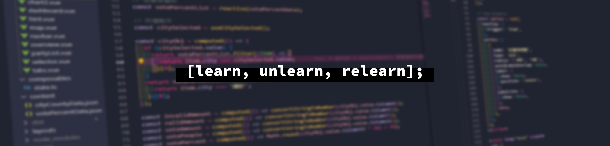

<h1 align="center">Hi 👋, I'm JC</h1>

  
  
  

### 🛠️ &nbsp;Tech Stack

&nbsp;
&nbsp;
&nbsp;
&nbsp;\
&nbsp;
&nbsp;
&nbsp;
&nbsp;

\
&nbsp;
&nbsp;
\
&nbsp;

&nbsp;
&nbsp;
&nbsp;

---

### 📊 &nbsp;Github Stats

  

  
  

---

### 🤝🏻 &nbsp;Connect with Me

